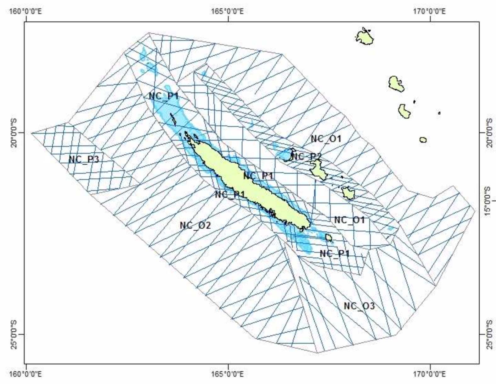

```{r, results=FALSE, message=FALSE}
library(EMtree)
library(tidyverse)
library(grid)
library(gridExtra)
library(tidygraph)
library(ggraph)
library(ggbeeswarm)
```

# Chargement et mise en forme des données

* Lignes nulles
* Format des covariables
* Y_corr = comptages moyens par détection 

```{r, fig.width=10, fig.height=9}
setwd(WorkDir <- "/Users/raphaellemomal/these/Data_Oak_remmoa/REMMOA")
ShapeDir <- paste(WorkDir, "shape", sep = "/")
OutDir <- paste(WorkDir, "output", sep = "/")
theme_set(theme_light())
load(paste(OutDir, "20180620_PLN_REMMOANC.RData", sep = "/"))
colnames(X)[7:8]<-c("Xcart","Ycart")
null_index=which(rowSums(Y)==0)
Y=as.matrix(Y[-null_index,])
X=as.matrix(X[-null_index,])
N=as.matrix(N[-null_index,])

# correction des comptages par le nombre de détection
Y_corr=as.matrix(Y/N)
Y_corr[!is.finite(Y_corr)]<-0

Y %>%as_tibble() %>%  gather(species, count) %>%filter(count!=0) %>%  ggplot(aes(reorder(species,count), count, color=species))+geom_quasirandom()+labs(x="", title="Non nul counts")+ coord_flip()+
  theme(axis.text.x = element_text( angle = 45,hjust=1))+guides(color=FALSE)

```
```{r, fig.width=10, fig.height=9}
# covariables numériques
X=data.frame(X)
X[,c(6:10,14:20)]<-apply(X[,c(6:10,14:20)], 2, function(x) as.numeric(x))

Xquanti=X[,c(6,9:10,14:20)] # sans Xcart et Ycart qui sont des transformations de longi et lati
plot(data.frame(Xquanti), pch=20, cex=0.5)

```


Fonctions utiles :

* Ajuster PLN avec des covariables de vec
* afficher le réseau après rééchantillonnage

```{r}
get_model<-function(data, vec){
  t1<-Sys.time()
  string<-paste(deparse(substitute(data)), paste(vec, collapse=" + "), sep=" ~ ")
  formula<-as.formula(string)
  mat = as.matrix(lm(formula, x=T)$x)
  model<-PLN(data ~ -1+mat)
  t2<-Sys.time()
  print(difftime(t2,t1))
  return(model)
}
get_network<-function(resample_output,title, data=Y, f=0.8){
  df<-freq_selec(resample_output$Pmat,p=ncol(data),f=f)
  graph<-draw_network(df,title, pal="dodgerblue3", 
                              names=colnames(data), layout="nicely", curv=0.1,
                      filterDeg=TRUE)
  return(graph)
}
```

# Modèles PLN

Plusieurs modèles PLN ont été ajustés et stockés dans models.RData.

* m0 : ~ 1
* m1 : ~ 1 + SEA_STATE
* m2 : ~ 1 + Depth
* m3 : ~ 1 + SUBJECTIVE
* m4 : ~ 1 + Depth + SUBJECTIVE
* m5 : ~ 1 + SEA_STATE + SUBJECTIVE
* m6 : ~ 1 + SEA_STATE + Depth
* m7 : ~ 1 + SEA_STATE + Depth + SUBJECTIVE
* m8 : ~ 1 + longitude + latitude
* m9 : ~ 1 + longitude + latitude + Depth
* m10 : ~ 1 + longitude + latitude + SEA_STATE + Depth + SUBJECTIVE

Les modèles sont ajustés pour les données brutes Y (pas Y_corr). Le temps d'ajustement varie entre environ 30s et plus de deux minutes pour m8 et m9.

```{r, eval=FALSE, echo=FALSE}
m0<-get_model(Y,"1") #22s
m1<-get_model(Y, "SEA_STATE") #30s
m2<-get_model(Y, "Depth") #26s, glm.fit: fitted rates numerically 0 occurred 
m3<-get_model(Y, "SUBJECTIVE") #28s
m4<-get_model(Y, vec1[-1])# 28s, In doTryCatch(return(expr), name, parentenv, handler) :display list redraw           incomplete
m5<-get_model(Y, vec1[-2]) #56s, glm.fit: fitted rates numerically 0 occurred 
m6<-get_model(Y, vec1[-3]) #33s, glm.fit: fitted rates numerically 0 occurred 
m7<-get_model(Y, vec1) # 57s, glm.fit: fitted rates numerically 0 occurred 
m8<-get_model(Y, vec2) # 2.6min
m9<-get_model(Y, c(vec2,"Depth")) # 2.6min, glm.fit: fitted rates numerically 0 occurred 
m10<-get_model(Y, c(vec1,vec2)) # 56s, glm.fit: fitted rates numerically 0 occurred
save(m0,m1,m2,m3,m4,m5,m6,m7,m8,m9,m10,file="models.RData")
```


```{r, echo=FALSE}
load("results/models.RData")
Lmodels<-list(m0,m1,m2,m3,m4,m5,m6,m7,m8,m9,m10)
names(Lmodels)=0:10
criteria<-lapply(seq_along(Lmodels),function(x){
  c(Lmodels[[x]]$criteria,model=names(Lmodels)[x])
})
criteria=data.frame(apply(do.call(rbind,criteria),2,  as.numeric))
criteria %>% gather(crit,value,-model) %>% 
  ggplot(aes(reorder(as.factor(model),-value), value, color=crit))+
  geom_point()+facet_grid(crit~., scales = "free")+theme_light()+guides(color=FALSE)+
  labs(x="model",y="criteria value")
```

* Dans PLN on veut des grandes valeurs pour BIC, ICL et loglik
* les modèles 2, 4, et 6 comprennent "depth", qui semble essentielle
* les coordonnées spatiales seules (modèle 8) montrent de belles performances
* cependant le temps d'ajustement est très conséquent (2.6min contre 28 à 56s pour les autres)
* le gain en ICL de 10 par rapport à 7 est négligeable 
* depth+sea_state est meilleur que depth+spatial

Comparons les réseaux obtenus avec m0, m2 et m7 (pas d'ajustement spatial donc).

# Les réseaux 
## Totaux
Les espèces surlignées en jaune dans les réseaux sont celles avec un score de betweenness important. La matrice d'offsets est la multiplication de la longueur du segment d'un site et de la largeur effective de l'espece.

* R_brut : m0 et sans matrice d'effort. 5min, alpha mean = 0.6959584
* R_offset : m0 avec matrice d'efforts.  5.3min alpha mean =  0.710248
* R_depth : m2 et effort. 5.9min alpha mean = 0.7966224
* R_full : m7 et effort. 15.3min alpha mean = 0.9731524

```{r,  fig.height=5, fig.width=10}

load("results/ReseauxEntiers.RData")
naif=get_network(R_brut,"naif")
offset=get_network(R_offset,"Offset")
depth<-get_network(R_depth,"~ Depth")
depth_seastate<-get_network(R_depth_seastate,"~ Depth+sea_state")


grid.arrange(naif,offset,nrow=1, ncol=2)
grid.arrange(depth,depth_seastate,nrow=1,ncol=3)

```


## Comparaison nord / sud

```{r, fig.height=5, fig.width=10}
indicesNorth=which(X$Ycart > 7.76e6 & X$Xcart > 2e5 & X$Xcart<6e5)
indicesSouth=which(X$Ycart < 7.55e6 & X$Ycart > 7.4e6 & X$Xcart > 5.5e5 & X$Xcart<9.5e5)

YNorth=Y[indicesNorth,]
null_colnorth=which(colSums(YNorth)==0)
YNorth=Y[indicesNorth,-null_colnorth]
YSouth=Y[indicesSouth,]
null_colsouth=which(colSums(YSouth)==0)
YSouth=Y[indicesSouth,-null_colsouth]

load("results/ReseauxNorth.RData")
graph0<-get_network(R_North,"Offset", data=YNorth)
graph_effort<-get_network(R_north_depth,"~ Depth", data=YNorth)
graph_depth<-get_network(R_north_full,"~ Depth+sea_state", data=YNorth)

grid.arrange(graph0,graph_effort,graph_depth,nrow=1, ncol=3, top="Détections au Nord")

```


```{r, fig.height=5, fig.width=10}

load("results/ReseauxSouth.RData")
graph0<-get_network(R_South,"Offset",data=YSouth)
graph_effort<-get_network(R_south_depth,"~ Depth",data=YSouth)
graph_depth<-get_network(R_south_full,"~ Depth+sea_state",data=YSouth)

grid.arrange(graph0,graph_effort,graph_depth,nrow=1, ncol=3, top="Détections au Sud")

```


## Comparaison par région

Le plan d'échantillonnage en Nouvelle-Calédonie a été séparée en 2 zones : Océanique et talus continental, ces deux zones sont elles-mêmes séparées en trois zones de transects.



```{r,fig.height=5, fig.width=10}

load("results/ReseauxRegion.RData")
load("results/DataRegion.RData")
Graphs=lapply(seq_along(ReseauxRegion), function(x){
  data=DataRegion[[x]]$Y
  get_network(ReseauxRegion[[x]], strsplit(names(ReseauxRegion)[x], split="_")[[1]][3], data=data)
})
grid.arrange(Graphs[[1]],Graphs[[2]],Graphs[[3]],ncol=3, nrow=1)
grid.arrange(Graphs[[4]],Graphs[[5]],Graphs[[6]],ncol=3, nrow=1)
```


