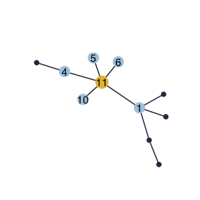
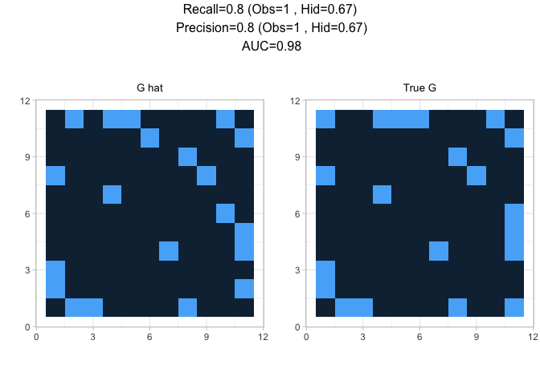
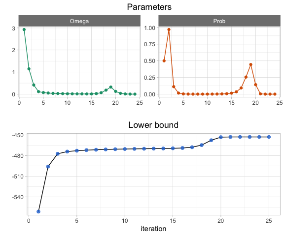

nestor: Network inference from Species counTs with missing actORs.
==================================================================

Simulation and preparation
--------------------------

`nestor` can simulate data with with missing actors with the function `missing_from_scratch()`. It requires the desired type of dependency structure (scale-free, erdos, tree or cluster) and the number of missing actors `r`. Here is an example with `r=1` for the scale-free structure:

``` r
library(nestor)
p=10
r=1
n=100
data=missing_from_scratch(n, p, r,type="scale-free", plot=TRUE)
```



The original clique of the missing actor neighbors is available in the value `TC`:

``` r
data$TC
#> [[1]]
#> [1]  1  4  5  6 10
```

The data is then prepared for analysis with the first step of the procedure: fit the PLN model. The `norm_PLN()` function is a wraper to `PLNmodels::PLN()` which normalizes all the necessary outputs, namely the mean, variance and correlation matrices of the model latent Gaussian layer corresponding to observed species.

``` r
PLNfit<-norm_PLN(data$Y)
MO<-PLNfit$MO
SO<-PLNfit$SO
sigma_obs=PLNfit$sigma_obs
```

Inference
---------

### Single clique initialization

`nestor` then needs to be initialized. This requires to find an initial clique of neighbors for the missing actor, for example using the `FitSparsePCA()` function:

``` r
initClique = FitSparsePCA(data$Y,r=1, min.size = 3)$cliques
initClique
#> [[1]]
#> [1]  2  5  7  9 10
```

The `min.size` parameter defines the minimal size of the output clique. The function `init_mclust()` is also available for finding a clique, it uses the package `mclust`.

Once an initial clique has been found, the algorithm can be initialized. This is the aim of the function `initVEM()`, which initializes all required parameters. This function builds one initialization from one initial clique. We initialize with the clique previously identified:

``` r
initList = initVEM(data$Y, cliqueList=initClique, sigma_obs, MO, r=1 )
```

Then to set the tempering parameter `alpha`, we can look at the output of the `alphaMax()` function.

``` r
alphaMax(p+r, n)
#> [1] 0.3000768
```

The actual tempering parameter should be lower than the upper bound given by `alphaMax()`. Here we set `alpha` to 0.1. The core function `nestor()` can now be run as follows:

``` r
fit = nestor(data$Y, MO,SO, initList=initList, alpha=0.1, eps=1e-3, 
           maxIter=30)
#> 
#> nestor ran in 1.087secs and 24 iterations.
```

The object `fit` contains inferred means and variances of the complete data, as well as edges weight and probability matrices.

This package contains several visualization functions. `plotPerf()` gives a quick overview of the fit performance compared to initial graph:

``` r
plotPerf(fit$Pg, data$G,r=1)
```



The convergence of `nestor()` can be checked with the plotting function `plotConv()`:

``` r
plotConv(nestorFit = fit)
```



### Initialization with a list of cliques

The fit of the `nestor()` function is very sensitive to the initialization, and so it is recommanded to try several initial cliques. Several functions are available for finding a list of possible starting points:

-   `init_blockmodels()` which uses package `blockmodels`,
-   `boot_FitSparsePCA()` is a bootstraped version using `sparsepca`,
-   `complement_spca()` looks in the complement of the `sparsepca` output.

Here we use the `complement_spca()` function, which runs `sparsepca` and returns the cliques corresponding to the `k` first principal components as well as their complement.

``` r
six_cliques = complement_spca(data$Y, k=3) 
six_cliques
#> [[1]]
#> [[1]][[1]]
#> [1] 2 9
#> 
#> 
#> [[2]]
#> [[2]][[1]]
#> [1]  7 10
#> 
#> 
#> [[3]]
#> [[3]][[1]]
#> [1]  2  5 10
#> 
#> 
#> [[4]]
#> [[4]][[1]]
#> [1]  1  3  4  5  6  7  8 10
#> 
#> 
#> [[5]]
#> [[5]][[1]]
#> [1] 1 2 3 4 5 6 8 9
#> 
#> 
#> [[6]]
#> [[6]][[1]]
#> [1] 1 3 4 6 7 8 9
```

This package provides with a parllel procedure for the computation of several fits of `nestor()` corresponding to a list of possible cliques, with the function `List.nestor()`. Below is an example with the list of six cliques previously obtained with the `complement_spca()` function:

``` r
fitList=List.nestor(six_cliques, data$Y, sigma_obs, MO,SO,r=1,eps=1e-3,
                    maxIter = 50, alpha=0.1)
```

The object `fitList` is simply the list of all the `nestor()` fits. This procedure aborts in case of degenerated behaviour, which happens when the provided clique is too far from truth. Wrong fits can be identified by their ouput size:

``` r
do.call(rbind,lapply(fitList, length))
#>      [,1]
#> [1,]    3
#> [2,]   12
#> [3,]    3
#> [4,]   12
#> [5,]   12
#> [6,]   12
```

Finally we can assess the performance of each converged fit with their AUC, precision and recall regarding the hidden node `h`, and the correlation between the inferred means and the original latent Gaussian vector of `h`.

``` r
do.call(rbind,lapply(fitList, function(vem){
  if(length(vem)>4){
    perf=ppvtpr(vem$Pg, data$G, r=r)
    c(auc=auc(vem$Pg, data$G),precH=perf$PPVH, recH=perf$TPRH, corMH=cor(vem$M[,p+r], data$UH))
  }
})) %>% as_tibble()  
#> # A tibble: 4 x 4
#>     auc precH  recH  corMH
#>   <dbl> <dbl> <dbl>  <dbl>
#> 1  0.81  0.6   0.5  -0.785
#> 2  0.93  0.75  1    -0.815
#> 3  0.76  0.5   0.67 -0.715
#> 4  0.69  0.43  0.5  -0.585
```
